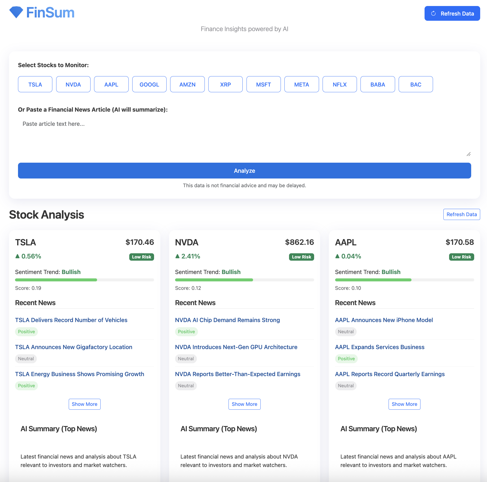

# FinSum - Financial Insights Dashboard

A modern, AI-powered financial insights dashboard with a clean, glassy Apple Vision OS style UI. This application provides stock data, sentiment analysis, and news summarization using OpenAI's GPT models to deliver actionable financial insights.



> **Note:** For demonstration purposes, the application uses mock data when API connections fail. This allows you to test functionality without valid API keys.

## Features

- **Real-time Stock Monitoring**: Track multiple stocks simultaneously with automatic data refresh
- **Multi-source Financial Data**: 
  - Primary data from Yahoo Finance with Alpha Vantage as fallback
  - Option to include NewsAPI as an additional news source
- **Sentiment Analysis**: 
  - Default VADER sentiment analysis for financial news
  - Optional FinBERT integration for more finance-specific sentiment analysis
- **AI-powered Insights**:
  - GPT-based news summarization with automatic caching to reduce token usage
  - Interactive Q&A for financial articles you paste in
- **Risk Assessment**: Smart risk scoring based on news sentiment, price changes, and market indicators
- **Modern UI**: Clean, glassy interface inspired by Apple Vision OS with responsive design
- **Automatic Updates**: Background scheduler refreshes data every 30 minutes

## Technical Overview

### Project Structure

```
finsum/
├── app/                        # Main application package
│   ├── analysis/               # Analysis modules
│   │   ├── data_fetch.py       # Stock data and news retrieval
│   │   ├── sentiment.py        # Sentiment analysis logic
│   │   ├── finbert_inference.py# Optional FinBERT integration
│   │   └── llm.py              # OpenAI GPT integration
│   ├── static/                 # CSS and static assets
│   └── templates/              # Jinja2 HTML templates
├── config.py                   # Configuration and API keys
├── app.py                      # Main Flask application
├── requirements.txt            # Full dependencies
├── requirements.txt.essential  # Minimal dependencies
├── run.sh                      # Helper script to run the app
├── setup_env.sh                # Environment variables setup
└── Dockerfile                  # Docker configuration
```

## Getting Started

### Prerequisites

- Python 3.10+
- API keys for:
  - OpenAI (for GPT integration)
  - Alpha Vantage (for financial data)
  - NewsAPI (optional, for additional news sources)

### Installation

1. Clone the repository and navigate to the project directory:
```bash
git clone https://github.com/yourusername/finsum.git
cd finsum
```

2. Set up your environment variables by creating a `.env` file with the following:
```
OPENAI_API_KEY=your_openai_api_key_here
SECRET_KEY=your_secret_key_here
```

3. Run the application using the included helper script:
```bash
./run.sh
```
This script will:
- Create a Python virtual environment
- Install dependencies
- Download necessary NLTK data
- Start the application

4. Access the application at: http://localhost:8086

### Manual Installation

If you prefer to set up manually:

1. Create a virtual environment:
```bash
python3 -m venv venv
source venv/bin/activate  # On Windows: venv\Scripts\activate
```

2. Install dependencies:
```bash
pip install -r requirements.txt
```

3. Run the application:
```bash
python app.py
```

### Using Docker

To run the application using Docker:

```bash
# Build the Docker image
docker build -t finsum .

# Run the container
docker run -p 8086:8086 \
  -e OPENAI_API_KEY="your_openai_key" \
  -e SECRET_KEY="your_secret_key" \
  finsum
```

## Mock Data Feature

For demonstration purposes, the application includes a fallback mechanism to use mock data when:
- API keys are not provided or are invalid
- API rate limits are exceeded
- Network connections fail

This allows you to test the application's functionality without valid API credentials. Stock prices and news articles are generated with realistic but fictional values.

## Advanced Features

### Using FinBERT for Enhanced Sentiment Analysis

FinBERT is a pre-trained NLP model specifically tuned for financial text. To enable it:

1. Ensure you've installed all dependencies including `transformers` and `torch`
2. Edit `config.py` and set `USE_FINBERT = True`
3. Restart the application

Note that FinBERT requires more system resources than the default VADER sentiment analyzer.

### Customizing Stocks

The default list of stocks can be modified in the `refresh_default_stocks()` function in `app.py`. The current defaults are:

```python
default_symbols = [
    "TSLA","NVDA","AAPL","GOOGL","AMZN","XRP",
    "MSFT","META","NFLX","BABA","BAC"
]
```

## Troubleshooting

### No News or Data Appearing

If you see "No recent news available" for all stocks:
1. Verify your OpenAI API key is correct
2. Check if you've exceeded your API rate limits (free tier has limitations)
3. Try clicking the "Refresh Data" button
4. Check the application logs in `app.log` for specific error messages

Note that without valid API keys, the application will fall back to mock data.

### Port Already in Use

If you see "Address already in use" when starting the application:
1. Edit the `PORT` variable in `app.py` to use a different port
2. Alternatively, identify and stop the process using the current port

## License

MIT License

## Acknowledgments

- [Alpha Vantage](https://www.alphavantage.co/) for financial data API
- [Yahoo Finance](https://finance.yahoo.com/) for stock data
- [OpenAI](https://openai.com/) for GPT API
- [NLTK](https://www.nltk.org/) for VADER sentiment analysis
- [FinBERT](https://github.com/ProsusAI/finBERT) for financial NLP
- [Flask](https://flask.palletsprojects.com/) for the web framework
- [Bootstrap](https://getbootstrap.com/) for UI components 